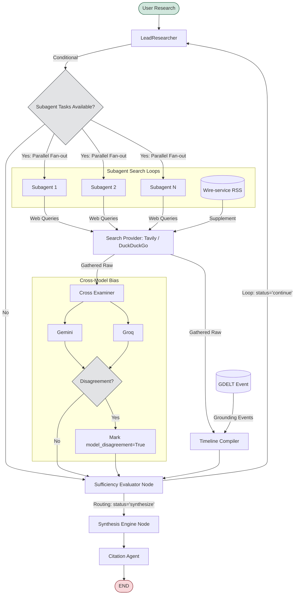

# Sentinel: Academic Research & Intelligence Pipeline

Sentinel is an autonomous, multi-agent research pipeline designed to synthesize formal, academic-grade research papers from raw web intelligence. Built on top of LangGraph, the system coordinates parallel-agent execution, cross-examines information across models for potential bias, compiles grounding event timelines, and generates peer-reviewed reports complete with inline citations, keywords, abstracts, and reference tracking.

---

## 1. System Architecture

Sentinel uses a stateful Graph orchestrator to manage search agents, analyze source bias, compile event timelines, evaluate completeness, and compile clean markdown reports.



### Pipeline Components

* **LeadResearcher (Orchestrator):** Performs query analysis, identifies research sub-tasks, plans execution, and dynamically dispatches tasks to parallel subagents.
* **Subagents (Parallel Search):** Perform targeted search loops, gather raw text and metadata from sources, and compile fact sheets locally to save memory.
* **Wire-service RSS Feeds:** Supplements queries by fetching live headlines and article metadata from feeds.
* **Cross-Examiner:** Detects source bias and reliability ratings against a local database (`data/bias_ratings.json`). Compares domain lean classifications across models (Gemini vs. Groq) and flags contradictions.
* **Timeline Compiler:** Merges chronologies, filters duplicate items, and resolves date inconsistencies using structured event data from GDELT.
* **Sufficiency Evaluator:** Inspects the current evidence backlog against the planned scope. If information gaps remain, it loops back for further iterations; otherwise, it triggers report compilation.
* **Synthesis Engine:** Compiles individual sections, generating front-matter (Title Page, Abstract, Keywords, and numbered headings) conforming to formal academic style guidelines.
* **Citation Agent:** Traces text assertions back to source URLs, aligns citations, formats a standardized Reference list, and tags uncorroborated text as `[UNCITED]`.

---

## 2. Configuration Settings (`.env`)

Sentinel is configured using environment variables. Adjust these values in your local `.env` file:

### API & Key Rotation
* `GOOGLE_API_KEY`: Primary Gemini API key.
* `GOOGLE_API_KEY_1`, `GOOGLE_API_KEY_2`, ...: Secondary keys. The system automatically rotates through this pool to handle rate limits and 503 overloads.
* `TAVILY_API_KEY`: Key for Tavily queries. Falls back to DuckDuckGo if blank or rate-limited.
* `GROQ_API_KEY`, `GROQ_API_KEY_1`, ...: Fallback keys for cross-model cross-examinations and overall failovers.

### Model Parameters
* `LLM_MODEL`: Primary reasoning model used for orchestration, timeline compiling, and final synthesis (e.g. `gemini-3.5-flash` or `gemini-3.1-flash-lite`).
* `SUBAGENT_MODEL`: Model used for parallel subagent search and extraction (e.g. `gemini-3.1-flash-lite`).
* `LLM_TEMPERATURE`: Control model creativity (default: `0.1` for objective research).

### Execution Budgets
* `MAX_RESEARCH_ITERATIONS`: The maximum number of feedback loops allowed before forcing synthesis (default: `1`).
* `MAX_SUBAGENTS`: The maximum number of parallel subagents spawned in one iteration (default: `2`).
* `MAX_SEARCH_CALLS_PER_SUBAGENT`: limit on search calls per agent (default: `3`).
* `SEARCH_PROVIDER`: Primary search runtime (`tavily` or `duckduckgo`).

---

## 3. Technology Stack

* **Orchestration:** LangGraph (StateGraph) supporting parallel execution branches.
* **LLM Layer:** Custom Gemini client wrapper with rate-limit tracking, blacklist rotation, and automatic Groq/Llama failovers.
* **Web UI:** Fast API ASGI backend coupled with a premium, responsive frontend dashboard featuring split-pane slider adjustments and structured sidebar navigation.
* **Database & Auth:** Supabase PostgreSQL integrations for sessions, user identity, and history.

---

## 4. Setup and Installation

### Prerequisites
* Python 3.11+
* Supabase Account & Database

### Installation Steps

1. **Clone and Install:**
   ```bash
   git clone https://github.com/compileandgo/sentinel.git
   cd sentinel
   ```

2. **Setup virtualenv:**
   Using `uv` (recommended):
   ```bash
   uv venv
   source .venv/bin/activate
   uv pip sync
   ```
   Or standard `pip`:
   ```bash
   python -m venv .venv
   source .venv/bin/activate
   pip install -r requirements.txt
   ```

3. **Configure Environment:**
   ```bash
   cp .env.example .env
   # Add your API credentials and Supabase URLs to .env
   ```

4. **Initialize Tables:**
   Execute the scripts in the `supabase-auth/` directory on your Supabase SQL editor to create the database schemas.

---

## 5. Running the Application

Start the local web application server:
```bash
python src/web/app.py
```
Access the application at `http://127.0.0.1:8000`.
