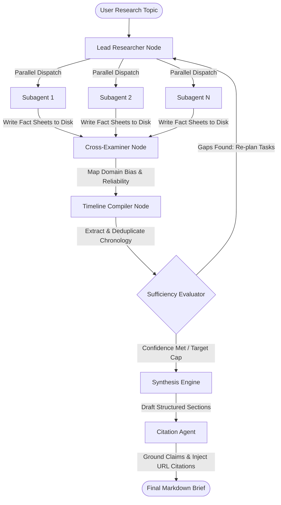

# Sentinel - Multi-Agent Intelligence Synthesis System

Sentinel is an analytical research pipeline designed to compile structured, bias-evaluated geopolitical intelligence briefs. The system implements a parallel-subagent architecture built on LangGraph to automate resource gathering, cross-examine domain bias, and synthesize long-form, fact-grounded reports.

---

## 1. System Architecture

Sentinel uses a stateful Graph orchestrator to coordinate parallel research subagents, compile factual timelines, evaluate research sufficiency, and synthesize final annotated reports.



### Pipeline Components

* **Lead Researcher (Orchestrator):** Analyzes the root topic, decomposes it into distinct non-overlapping task specifications, and assigns them to parallel subagents.
* **Subagents (Parallel Workers):** Execute search-evaluate-refine loops on the configured search provider. Each subagent compiles a local Markdown fact sheet (findings, metrics, named entities, and source URLs) to the workspace disk to keep graph states lightweight.
* **Cross-Examiner:** References domains against a static credibility database (`data/bias_ratings.json`) and runs classifications on source lean and reliability to compile a unified bias matrix.
* **Timeline Compiler:** Parses raw findings, extracts explicitly dated events, deduplicates entries, and flags historical or sequence conflicts.
* **Sufficiency Evaluator:** Reviews gathered intelligence against the target query backlog. If requirements are met, it triggers synthesis; otherwise, it loops back to the Lead Researcher with missing gaps.
* **Synthesis Engine:** Drafts the multi-section strategic brief. It structures the text dynamically, formats comparative data tables, embeds Mermaid process charts, and filters out source biases.
* **Citation Agent:** Scans the synthesized text, matches assertions against source lists, and injects inline URL citations (flagging uncorroborated text as `[UNCITED]`).

---

## 2. Configuration Settings (.env)

Sentinel is configured using environment variables. Adjust these values in your local `.env` file:

### API & Key Rotation
* `GOOGLE_API_KEY`: Primary Google Gemini API key.
* `GOOGLE_API_KEY_1`, `GOOGLE_API_KEY_2`, ...: Optional secondary keys. The API client automatically rotates keys on rate-limit (429) exhaustion.
* `TAVILY_API_KEY`: API credential for Tavily search queries.

### Model Parameters
* `LLM_MODEL`: Used for orchestration, timeline compilation, and final synthesis (default: `gemini-3.5-flash` for deep reasoning).
* `SUBAGENT_MODEL`: Used for parallel subagent search and extraction loops (default: `gemini-3.1-flash-lite` for rate-limit and cost efficiency).
* `LLM_TEMPERATURE`: LLM generation temperature (default: `0.1`).

### Execution Limits
* `MAX_RESEARCH_ITERATIONS`: Cap on orchestrator feedback loops (default: `1`).
* `MAX_SUBAGENTS`: Maximum parallel subagent instances spawned per iteration (default: `2`).
* `MAX_SEARCH_CALLS_PER_SUBAGENT`: Maximum search requests allowed per subagent (default: `3`).
* `SEARCH_PROVIDER`: Primary search runtime (`tavily` or `duckduckgo`).

### Database & Authentication
* `SUPABASE_URL`: Supabase project URL.
* `SUPABASE_ANON_KEY`: Client access key for Supabase.
* `SUPABASE_SERVICE_ROLE_KEY`: Service account token for database read/write actions.
* `SUPABASE_JWT_SECRET`: Signing verification key for authentication tokens.

---

## 3. Technology Stack

* **Graph Orchestration:** LangGraph (StateGraph) with dynamic concurrent dispatch.
* **LLM Engine:** Gemini API client with multi-key failover capabilities.
* **Data Gathering:** Tavily API (Primary) and DuckDuckGo API (Fallback).
* **Server Framework:** FastAPI (ASGI Python Web Server).
* **Database & Persistence:** Supabase (PostgreSQL tables, session logs, and auth).
* **Frontend:** Vanilla HTML, CSS, JavaScript (Responsive layout with split-pane slider adjustments and outline sidebars).

---

## 4. Setup and Installation

### Prerequisites
* Python 3.11+
* Active Supabase Database

### Installation Steps

1. **Clone the Repository:**
   ```bash
   git clone https://github.com/compileandgo/sentinel.git
   cd sentinel
   ```

2. **Set Up Python Environment:**
   Using standard `pip`:
   ```bash
   python -m venv .venv
   source .venv/bin/activate
   pip install -r requirements.txt
   ```
   Or using `uv` (recommended):
   ```bash
   uv venv
   source .venv/bin/activate
   uv pip sync
   ```

3. **Configure Environment:**
   ```bash
   cp .env.example .env
   # Add your API credentials and database configuration to .env
   ```

4. **Initialize Database:**
   Run the SQL scripts provided in the `supabase-auth/` directory on your Supabase SQL editor to create the necessary tables.

---

## 5. Running the Application

Start the local web application server:
```bash
python src/web/app.py
```
Access the application at `http://127.0.0.1:8000`.

---

## 6. Production Scaling

For scaling paths (integrating Redis task queues, Celery workers, sliding-window rate limiters, semantic caching, and uvicorn clustering), see the [scaling_plan.md](scaling_plan.md) document.
